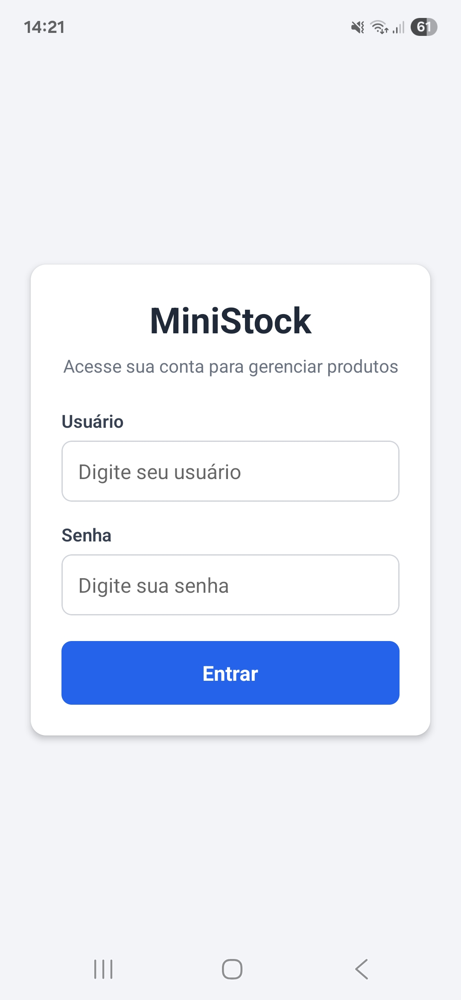
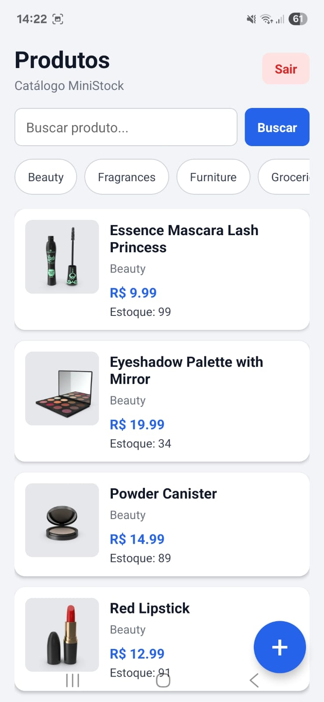
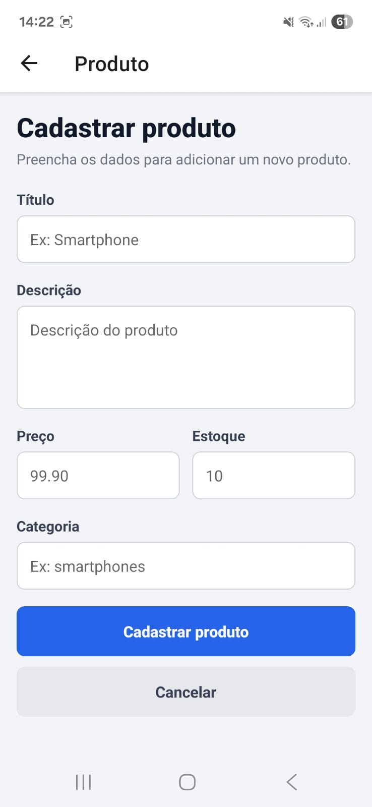

# MiniStock Mobile

MiniStock Mobile é um aplicativo desenvolvido em React Native com Expo para a disciplina de Programação para Dispositivos Móveis. O projeto simula um sistema mobile para gerenciamento de produtos de uma loja, permitindo que colaboradores consultem, cadastrem, editem e excluam produtos diretamente pelo celular.

O principal objetivo do projeto é praticar a integração de uma aplicação mobile com uma API REST utilizando a biblioteca axios de forma organizada e profissional, respeitando a separação entre telas, componentes, contexto de autenticação, armazenamento local e camada de serviços.

---

## Tecnologias utilizadas

- React Native
- Expo
- TypeScript
- axios
- React Navigation
- AsyncStorage
- DummyJSON API

---

## Funcionalidades implementadas

O aplicativo possui autenticação de usuário com persistência de token utilizando AsyncStorage, mantendo a sessão ativa entre aberturas do app. Após o login, o usuário acessa uma área protegida com listagem de produtos consumidos da API DummyJSON.

A listagem de produtos utiliza FlatList, paginação infinita, pull to refresh, busca textual e filtro dinâmico por categoria. Também foram implementadas telas de detalhes do produto e formulário único para cadastro e edição.

O aplicativo contempla as seguintes funcionalidades:

- Login com usuário e senha
- Persistência do token com AsyncStorage
- Navegação protegida
- Logout funcional
- Listagem de produtos com FlatList
- Paginação infinita
- Pull to refresh
- Busca por termo
- Filtro por categoria
- Tela de detalhes do produto
- Cadastro de produto
- Edição de produto
- Exclusão com confirmação usando Alert.alert
- Tratamento de loading, erro e estado vazio

---

## Credenciais de teste

Para acessar o aplicativo, utilize as credenciais fornecidas pela API DummyJSON:

Usuário: emilys  
Senha: emilyspass

---

## API utilizada

O projeto utiliza a API pública DummyJSON:

https://dummyjson.com

### Endpoints utilizados

| Método | Endpoint |
|---|---|
| POST | `/auth/login` |
| GET | `/products` |
| GET | `/products/search` |
| GET | `/products/category-list` |
| GET | `/products/category/{slug}` |
| GET | `/products/{id}` |
| POST | `/products/add` |
| PUT | `/products/{id}` |
| DELETE | `/products/{id}` |

---

## Observação sobre cadastro, edição e exclusão

A API DummyJSON simula as operações de escrita. Isso significa que as requisições de cadastro, edição e exclusão retornam uma resposta de sucesso, porém os dados não são persistidos definitivamente no catálogo público da API.

Dessa forma, o aplicativo utiliza a resposta da API como confirmação da operação realizada.

---

## Organização do projeto

A estrutura do projeto foi organizada em camadas para facilitar manutenção, leitura e separação de responsabilidades.

```txt
src/
├── components/
│   ├── EmptyState.tsx
│   ├── Loading.tsx
│   └── ProductCard.tsx
│
├── contexts/
│   └── AuthContext.tsx
│
├── navigation/
│   └── AppNavigator.tsx
│
├── screens/
│   ├── LoginScreen.tsx
│   ├── ProductListScreen.tsx
│   ├── ProductDetailScreen.tsx
│   └── ProductFormScreen.tsx
│
├── services/
│   ├── api.ts
│   ├── auth.ts
│   └── products.ts
│
└── storage/
    └── authStorage.ts
```

---

## Como executar o projeto

Clone o repositório:

```bash
git clone https://github.com/HiagoLMFerreira/ministock
```

Acesse a pasta do projeto:

```bash
cd ministock
```

Instale as dependências:

```bash
npm install
```

Execute o projeto:

```bash
npx expo start
```

Caso esteja no Windows e ocorra bloqueio no PowerShell, utilize:

```bash
npx.cmd expo start
```

---

## Dependências principais

Caso seja necessário instalar manualmente as dependências principais, utilize:

```bash
npm install axios @react-native-async-storage/async-storage
npm install @react-navigation/native @react-navigation/native-stack
npx expo install react-native-screens react-native-safe-area-context
npx expo install typescript @types/react
```

---

## Demonstração

Link do vídeo demonstrativo:

[Vídeo demonstrativo](https://drive.google.com/file/d/1-V3lJHV_put0X7hfOSzEbTMooN8i0KEg/view?usp=drive_link)

---

## Capturas de tela

Adicionar abaixo as principais capturas de tela do aplicativo.

### Tela de login



### Tela de listagem



### Tela de detalhes


### Tela de formulário



---

## Autor

Desenvolvido por Hiago Ferreira.